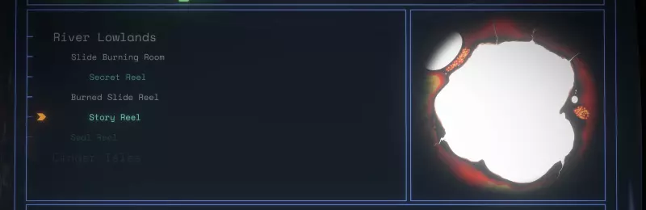
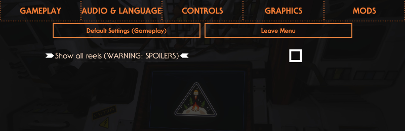

# Ship Log Slide Reel Player Plus by Damián Garro

Play Echoes of the Eye slide reels in your Ship Log computer with an enhanced player!

Back from the dead! This mod adds new entries to the Ship Log Map Mode that represent reels and visions, included under the entries of the locations where they are found.

The game already displays them in regular entries if they have facts referring to them (also in Rumor Mode), but the Reel Player Plus includes additional features:
* In addition to play the reel/vision automatically (similar to a vision), you can also manually go to the next or previous slide (similar to the slide projector).
* The images are displayed in full color.
* Visions doesn't include the round vignette, the full textures are shown.
* Music is also reproduced!
* All reels and visions are showed.* The vanilla player lacks some because it only shows the ones that has Ship Log facts about them, but there are a couple that aren't mentioned in the logs (and there's also an special one that actually appears in the logs but it isn't displayed, probably because another reason that I don't want to spoil. Not only that, some of them are only associated with rumor facts, and we you explore its entry then you wouldn't be able to play it on the Ship Log anymore (except in some cases where they are playable in the arrows of the Rumor Mode).
* *More to come?*

*Because some reels/visions aren't tracked by Ship Log facts, the mod doesn't have a way of knowing if you actually watched them before installing it. So, in order to include those specific reels/visions in the Map Mode, you would have to watch them again while the mod is installed (this is persisted on your save file, next time you boot the game the mod will remember it!).

There is also an option you can toggle to show ALL slide reels and visions, even the ones you haven't seen before. **Beware of spoilers**, only activate this option if you already played the complete Echoes of the Eye expansion. This setting is disabled by default.

 The vanilla player is actually pretty cool to see the reels/visions mentioned by the selected entries (in some cases this even means that a reel/vision could be shown in more that one entry), so this mods won't remove it.

In a future update, the "reel entries" added by this mod will be moved to a custom Ship Log mode instead of cluttering the Map Mode, for a better organization, consistency and easier navigation.
