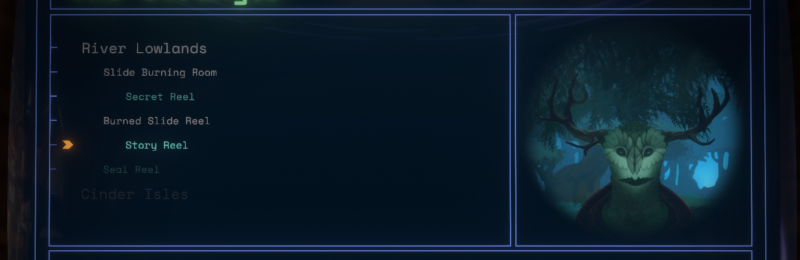
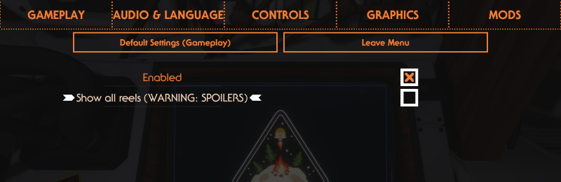

# Ship Log Slide Reel Player by Damián Garro

Play Echoes of the Eye slide reels in your ship log computer!

You can replay the slide reels (and also visions) in the map mode of the ship log, simply go the map mode and browse the entries in The Stranger.

The reels that are shown in the ship logs are the ones you fully watched in the game while the mod was installed (this is persisted on your save file), so even if you have a profile where you completed Echoes of the Eye you won't see the reels in the ship log until you watch them again with the mod active. At least that gives you a reason to replay the expansion: to collect them all! (or just use the setting explained bellow)

There is also an option you can toggle to show ALL slide reels and visions, even the ones you haven't seen before. **Beware of spoilers**, only activate this option if you already played the complete the expansion. This setting is disabled by default.