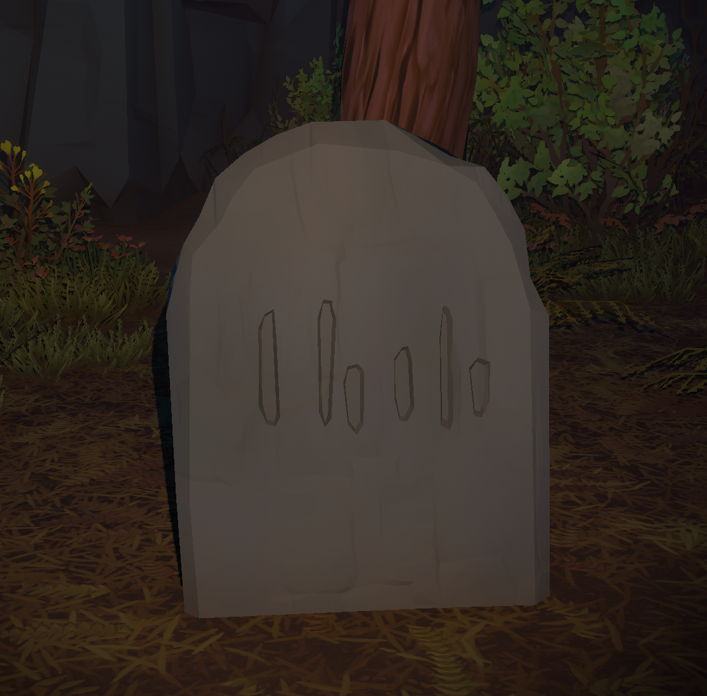
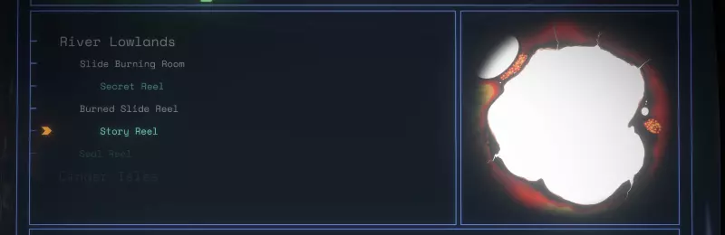

# ⚠️ IMPORTANT NOTICE ⚠️

This mod was removed from the [Outer Wilds Mods Database](https://github.com/ow-mods/ow-mod-db) since [Outer Wilds Patch 13](https://www.mobiusdigitalgames.com/news/patch-13-is-now-available) was released because that update officially implemented watching slide shows in the sip log ("Playing Echoes of the Eye no longer requires a photographic memory") and the mod doesn't work anymore.

If for some reason you are playing an older version of the game you still may [download this mod](https://github.com/dgarroDC/ShipLogSlideReelPlayer/releases/tag/1.2.0).

I may update this mod to make it upgrade the official feature with the feature this mod had (music, color, the possibility to manually change slides instead of only playing it automatically), but that would require some work because the patch changed a lot of things.

---

# Ship Log Slide Reel Player by Damián Garro

Play Echoes of the Eye slide reels in your ship log computer!

You can replay the slide reels (and also visions) in the map mode of the ship log, simply go the map mode and browse the entries in The Stranger. Each reel entry is shown under the log entry corresponding to the place the reel was found. It also plays audio! 

While you are watching a reel entry, you can manually go to the next or previous slide (similar to the Echoes of the Eye slide projector) or play it automatically (similar to a vision).

This mod is compatible and also integrated to the [Suit Log](https://outerwildsmods.com/mods/suitlog/) mod, if you install both mods you can also view reels in your Suit Log. You no longer need to exit the Stranger or restart the loop to view the reels!

The reels that are shown in the ship logs are the ones you fully watched in the game while the mod was installed (this is persisted on your save file), so even if you have a profile where you completed Echoes of the Eye you won't see the reels in the ship log until you watch them again with the mod active. At least that gives you a reason to replay the expansion: to collect them all! *(or just use the setting explained bellow)*

There is also an option you can toggle to show ALL slide reels and visions, even the ones you haven't seen before. **Beware of spoilers**, only activate this option if you already played the complete Echoes of the Eye expansion. This setting is disabled by default.
